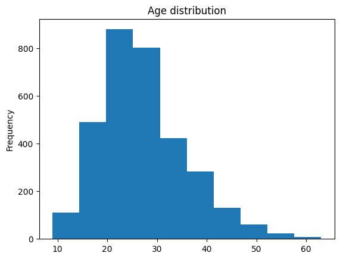
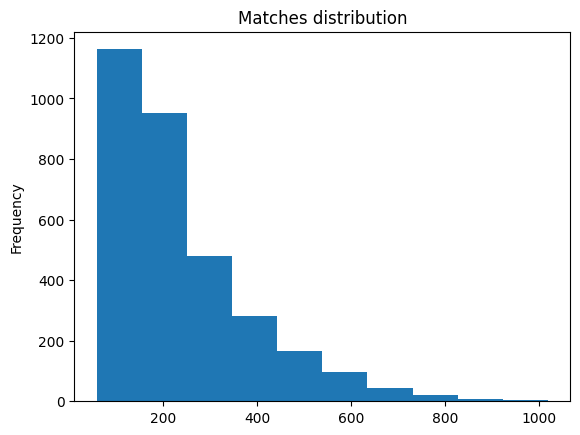

# Web Scraping Table Tenis WTT

# Objetivo

Raspar as Estatísticas de Win Rate, de Partidas de Tênis de Mesa de todos os eventos ja realizados e Analisar os dados utilizando apenas tabelas, no primeiro momento.
Ps: Os dados foram coletados na data de referência 30/03/2025.

# Formato dos Dados

<table border="1" class="dataframe">
  <thead>
    <tr style="text-align: right;">
      <th></th>
      <th>Name</th>
      <th>Gender</th>
      <th>Matches</th>
      <th>Wins</th>
      <th>Win Rate %</th>
      <th>Age</th>
    </tr>
  </thead>
  <tbody>
    <tr>
      <th>0</th>
      <td>CALDERANO Hugo (BRA)</td>
      <td>Male</td>
      <td>965</td>
      <td>739</td>
      <td>76.58</td>
      <td>28</td>
    </tr>
    <tr>
      <th>1</th>
      <td>SZOCS Bernadette (ROU)</td>
      <td>Female</td>
      <td>1018</td>
      <td>722</td>
      <td>70.92</td>
      <td>30</td>
    </tr>
    <tr>
      <th>2</th>
      <td>DIAZ Adriana (PUR)</td>
      <td>Female</td>
      <td>986</td>
      <td>710</td>
      <td>72.01</td>
      <td>24</td>
    </tr>
    <tr>
      <th>3</th>
      <td>MA Long (CHN)</td>
      <td>Male</td>
      <td>765</td>
      <td>669</td>
      <td>87.45</td>
      <td>36</td>
    </tr>
    <tr>
      <th>4</th>
      <td>OVTCHAROV Dimitrij (GER)</td>
      <td>Male</td>
      <td>896</td>
      <td>646</td>
      <td>72.10</td>
      <td>36</td>
    </tr>
  </tbody>
</table>

# Top 10 Ranking Mundial

| Rank | Points | Name                  | Country |
|------|--------|-----------------------|---------|
| 1    | 8325   | LIN Shidong            | [CHN]   |
| 2    | 6925   | WANG Chuqin            | [CHN]   |
| 3    | 4725   | HARIMOTO Tomokazu      | [JPN]   |
| 4    | 3550   | LIANG Jingkun          | [CHN]   |
| 5    | 3250   | CALDERANO Hugo         | [BRA]   |
| 6    | 3170   | LEBRUN Felix           | [FRA]   |
| 7    | 2980   | MOREGARD Truls         | [SWE]   |
| 8    | 2660   | FRANZISKA Patrick      | [GER]   |
| 9    | 2420   | LEBRUN Alexis          | [FRA]   |
| 10   | 2415   | LIN Gaoyuan            | [CHN]   |

# Percentual de Jogadores por Gênero

| Gender | Proportion |
|--------|------------|
| Male   | 0.558942   |
| Female | 0.441058   |

# Distribuição das Idades

# Distribuição das Partidas

# Top 5 Jogadores com mais partidas ordenados por Win Rate

<table border="1" class="dataframe">
  <thead>
    <tr style="text-align: right;">
      <th></th>
      <th>Name</th>
      <th>Gender</th>
      <th>Matches</th>
      <th>Wins</th>
      <th>Win Rate %</th>
      <th>Age</th>
    </tr>
  </thead>
  <tbody>
    <tr>
      <th>0</th>
      <td>CALDERANO Hugo (BRA)</td>
      <td>Male</td>
      <td>965</td>
      <td>739</td>
      <td>76.58</td>
      <td>28</td>
    </tr>
    <tr>
      <th>2</th>
      <td>DIAZ Adriana (PUR)</td>
      <td>Female</td>
      <td>986</td>
      <td>710</td>
      <td>72.01</td>
      <td>24</td>
    </tr>
    <tr>
      <th>1</th>
      <td>SZOCS Bernadette (ROU)</td>
      <td>Female</td>
      <td>1018</td>
      <td>722</td>
      <td>70.92</td>
      <td>30</td>
    </tr>
    <tr>
      <th>7</th>
      <td>CHUANG Chih-Yuan (TPE)</td>
      <td>Male</td>
      <td>949</td>
      <td>611</td>
      <td>64.38</td>
      <td>43</td>
    </tr>
    <tr>
      <th>18</th>
      <td>CHENG I-Ching (TPE)</td>
      <td>Female</td>
      <td>903</td>
      <td>554</td>
      <td>61.35</td>
      <td>33</td>
    </tr>
  </tbody>
</table>

# Win Rate por Gênero e Média da Idade por Gênero

<table border="1" class="dataframe">
  <thead>
    <tr style="text-align: right;">
      <th></th>
      <th>Win Rate %</th>
    </tr>
    <tr>
      <th>Gender</th>
      <th></th>
    </tr>
  </thead>
  <tbody>
    <tr>
      <th>Female</th>
      <td>57.471700</td>
    </tr>
    <tr>
      <th>Male</th>
      <td>57.604786</td>
    </tr>
  </tbody>
</table>

<table border="1" class="dataframe">
  <thead>
    <tr style="text-align: right;">
      <th></th>
      <th>Age</th>
    </tr>
    <tr>
      <th>Gender</th>
      <th></th>
    </tr>
  </thead>
  <tbody>
    <tr>
      <th>Female</th>
      <td>27.040903</td>
    </tr>
    <tr>
      <th>Male</th>
      <td>27.425710</td>
    </tr>
  </tbody>
</table>

# Média de Partidas por Gênero

<table border="1" class="dataframe">
  <thead>
    <tr style="text-align: right;">
      <th></th>
      <th>Matches</th>
    </tr>
    <tr>
      <th>Gender</th>
      <th></th>
    </tr>
  </thead>
  <tbody>
    <tr>
      <th>Female</th>
      <td>239.279267</td>
    </tr>
    <tr>
      <th>Male</th>
      <td>239.809683</td>
    </tr>
  </tbody>
</table>

# Top 5 Paises com Mais Partidas Disputadas

<table border="1" class="dataframe">
  <thead>
    <tr style="text-align: right;">
      <th></th>
      <th>Matches per Country</th>
    </tr>
    <tr>
      <th>country</th>
      <th></th>
    </tr>
  </thead>
  <tbody>
    <tr>
      <th>Benin</th>
      <td>483.000000</td>
    </tr>
    <tr>
      <th>Seychelles</th>
      <td>336.000000</td>
    </tr>
    <tr>
      <th>Uruguay</th>
      <td>330.500000</td>
    </tr>
    <tr>
      <th>Belgium</th>
      <td>324.000000</td>
    </tr>
    <tr>
      <th>Romania</th>
      <td>316.676471</td>
    </tr>
  </tbody>
</table>

# Top 5 Paises por Win Rate

<table border="1" class="dataframe">
  <thead>
    <tr style="text-align: right;">
      <th></th>
      <th>Win Rate % per Country</th>
    </tr>
    <tr>
      <th>country</th>
      <th></th>
    </tr>
  </thead>
  <tbody>
    <tr>
      <th>Uganda</th>
      <td>82.610000</td>
    </tr>
    <tr>
      <th>China</th>
      <td>80.466094</td>
    </tr>
    <tr>
      <th>Iceland</th>
      <td>71.430000</td>
    </tr>
    <tr>
      <th>Macau</th>
      <td>71.213333</td>
    </tr>
    <tr>
      <th>Monaco</th>
      <td>69.285000</td>
    </tr>
  </tbody>
</table>

# Top 3 Paises mais Jovens

<table border="1" class="dataframe">
  <thead>
    <tr style="text-align: right;">
      <th></th>
      <th>Avg Age</th>
    </tr>
    <tr>
      <th>country</th>
      <th></th>
    </tr>
  </thead>
  <tbody>
    <tr>
      <th>Uganda</th>
      <td>10.0</td>
    </tr>
    <tr>
      <th>Lebanon</th>
      <td>14.0</td>
    </tr>
    <tr>
      <th>Netherlands Antilles</th>
      <td>15.0</td>
    </tr>
  </tbody>
</table>

# Top 3 Paises mais Experientes

<table border="1" class="dataframe">
  <thead>
    <tr style="text-align: right;">
      <th></th>
      <th>Avg Age</th>
    </tr>
    <tr>
      <th>country</th>
      <th></th>
    </tr>
  </thead>
  <tbody>
    <tr>
      <th>Pakistan</th>
      <td>58.0</td>
    </tr>
    <tr>
      <th>Morocco</th>
      <td>45.0</td>
    </tr>
    <tr>
      <th>Iceland</th>
      <td>42.0</td>
    </tr>
  </tbody>
</table>

# Top 3 Win Rate por Categoria - Masculino

<table border="1" class="dataframe">
  <thead>
    <tr style="text-align: right;">
      <th></th>
      <th>Name</th>
      <th>Gender</th>
      <th>Matches</th>
      <th>Wins</th>
      <th>Win Rate %</th>
      <th>Age</th>
      <th>country</th>
      <th>Category</th>
    </tr>
  </thead>
  <tbody>
    <tr>
      <th>29</th>
      <td>FAN Zhendong (CHN)</td>
      <td>Male</td>
      <td>548</td>
      <td>486</td>
      <td>88.69</td>
      <td>28</td>
      <td>China</td>
      <td>Senior</td>
    </tr>
    <tr>
      <th>2548</th>
      <td>YANG Shuo (CHN)</td>
      <td>Male</td>
      <td>74</td>
      <td>65</td>
      <td>87.84</td>
      <td>24</td>
      <td>China</td>
      <td>Senior</td>
    </tr>
    <tr>
      <th>2318</th>
      <td>SONG Xu (CHN)</td>
      <td>Male</td>
      <td>82</td>
      <td>72</td>
      <td>87.80</td>
      <td>28</td>
      <td>China</td>
      <td>Senior</td>
    </tr>
    <tr>
      <th>1757</th>
      <td>SEBATINDIRA Joseph (UGA)</td>
      <td>Male</td>
      <td>115</td>
      <td>95</td>
      <td>82.61</td>
      <td>10</td>
      <td>Uganda</td>
      <td>Sub-11</td>
    </tr>
    <tr>
      <th>2333</th>
      <td>ISKANDAROV Khusen (UZB)</td>
      <td>Male</td>
      <td>103</td>
      <td>72</td>
      <td>69.90</td>
      <td>10</td>
      <td>Uzbekistan</td>
      <td>Sub-11</td>
    </tr>
    <tr>
      <th>3114</th>
      <td>SHIRIEV Amir (UZB)</td>
      <td>Male</td>
      <td>94</td>
      <td>52</td>
      <td>55.32</td>
      <td>9</td>
      <td>Uzbekistan</td>
      <td>Sub-11</td>
    </tr>
    <tr>
      <th>3063</th>
      <td>OKADA Sora (JPN)</td>
      <td>Male</td>
      <td>63</td>
      <td>53</td>
      <td>84.13</td>
      <td>12</td>
      <td>Japan</td>
      <td>Sub-13</td>
    </tr>
    <tr>
      <th>1457</th>
      <td>MAYOROV Ladimir (ESP)</td>
      <td>Male</td>
      <td>147</td>
      <td>114</td>
      <td>77.55</td>
      <td>11</td>
      <td>Spain</td>
      <td>Sub-13</td>
    </tr>
    <tr>
      <th>1588</th>
      <td>FEGERL Louis (AUT)</td>
      <td>Male</td>
      <td>140</td>
      <td>106</td>
      <td>75.71</td>
      <td>11</td>
      <td>Austria</td>
      <td>Sub-13</td>
    </tr>
    <tr>
      <th>2811</th>
      <td>THIOFILO Vitor (BRA)</td>
      <td>Male</td>
      <td>69</td>
      <td>59</td>
      <td>85.51</td>
      <td>13</td>
      <td>Brazil</td>
      <td>Sub-15</td>
    </tr>
    <tr>
      <th>2631</th>
      <td>CHENG Min-Hsiu (TPE)</td>
      <td>Male</td>
      <td>74</td>
      <td>63</td>
      <td>85.14</td>
      <td>14</td>
      <td>Chinese Taipei</td>
      <td>Sub-15</td>
    </tr>
    <tr>
      <th>1440</th>
      <td>CHEN Kai-Cheng (TPE)</td>
      <td>Male</td>
      <td>137</td>
      <td>115</td>
      <td>83.94</td>
      <td>14</td>
      <td>Chinese Taipei</td>
      <td>Sub-15</td>
    </tr>
    <tr>
      <th>1441</th>
      <td>ROMANSKI Lucas (BRA)</td>
      <td>Male</td>
      <td>140</td>
      <td>115</td>
      <td>82.14</td>
      <td>16</td>
      <td>Brazil</td>
      <td>Sub-17</td>
    </tr>
    <tr>
      <th>781</th>
      <td>LI Hechen (CHN)</td>
      <td>Male</td>
      <td>221</td>
      <td>181</td>
      <td>81.90</td>
      <td>16</td>
      <td>China</td>
      <td>Sub-17</td>
    </tr>
    <tr>
      <th>636</th>
      <td>KUO Guan-Hong (TPE)</td>
      <td>Male</td>
      <td>249</td>
      <td>203</td>
      <td>81.53</td>
      <td>16</td>
      <td>Chinese Taipei</td>
      <td>Sub-17</td>
    </tr>
    <tr>
      <th>1224</th>
      <td>SUN Yang (CHN)</td>
      <td>Male</td>
      <td>146</td>
      <td>130</td>
      <td>89.04</td>
      <td>17</td>
      <td>China</td>
      <td>Sub-19</td>
    </tr>
    <tr>
      <th>1118</th>
      <td>WEN Ruibo (CHN)</td>
      <td>Male</td>
      <td>162</td>
      <td>141</td>
      <td>87.04</td>
      <td>18</td>
      <td>China</td>
      <td>Sub-19</td>
    </tr>
    <tr>
      <th>2401</th>
      <td>WANG Jixuan (CHN)</td>
      <td>Male</td>
      <td>83</td>
      <td>70</td>
      <td>84.34</td>
      <td>17</td>
      <td>China</td>
      <td>Sub-19</td>
    </tr>
    <tr>
      <th>643</th>
      <td>LIN Shidong (CHN)</td>
      <td>Male</td>
      <td>244</td>
      <td>202</td>
      <td>82.79</td>
      <td>19</td>
      <td>China</td>
      <td>Sub-21</td>
    </tr>
    <tr>
      <th>2329</th>
      <td>HAGIHARA Keishi (JPN)</td>
      <td>Male</td>
      <td>88</td>
      <td>72</td>
      <td>81.82</td>
      <td>19</td>
      <td>Japan</td>
      <td>Sub-21</td>
    </tr>
    <tr>
      <th>825</th>
      <td>HUANG Youzheng (CHN)</td>
      <td>Male</td>
      <td>213</td>
      <td>174</td>
      <td>81.69</td>
      <td>19</td>
      <td>China</td>
      <td>Sub-21</td>
    </tr>
    <tr>
      <th>3</th>
      <td>MA Long (CHN)</td>
      <td>Male</td>
      <td>765</td>
      <td>669</td>
      <td>87.45</td>
      <td>36</td>
      <td>China</td>
      <td>Veteran 30+</td>
    </tr>
    <tr>
      <th>36</th>
      <td>XU Xin (CHN)</td>
      <td>Male</td>
      <td>548</td>
      <td>468</td>
      <td>85.40</td>
      <td>35</td>
      <td>China</td>
      <td>Veteran 30+</td>
    </tr>
    <tr>
      <th>2128</th>
      <td>XU Chenhao (CHN)</td>
      <td>Male</td>
      <td>94</td>
      <td>79</td>
      <td>84.04</td>
      <td>30</td>
      <td>China</td>
      <td>Veteran 30+</td>
    </tr>
    <tr>
      <th>47</th>
      <td>WANG Hao (CHN)</td>
      <td>Male</td>
      <td>527</td>
      <td>442</td>
      <td>83.87</td>
      <td>41</td>
      <td>China</td>
      <td>Veteran 40+</td>
    </tr>
    <tr>
      <th>89</th>
      <td>MA Lin (CHN)</td>
      <td>Male</td>
      <td>478</td>
      <td>399</td>
      <td>83.47</td>
      <td>45</td>
      <td>China</td>
      <td>Veteran 40+</td>
    </tr>
    <tr>
      <th>171</th>
      <td>WANG Liqin (CHN)</td>
      <td>Male</td>
      <td>419</td>
      <td>346</td>
      <td>82.58</td>
      <td>46</td>
      <td>China</td>
      <td>Veteran 40+</td>
    </tr>
    <tr>
      <th>2866</th>
      <td>PLACHY Josef (CZE)</td>
      <td>Male</td>
      <td>82</td>
      <td>57</td>
      <td>69.51</td>
      <td>53</td>
      <td>Czech Republic</td>
      <td>Veteran 50+</td>
    </tr>
    <tr>
      <th>2501</th>
      <td>ST LOUIS Dexter (TTO)</td>
      <td>Male</td>
      <td>96</td>
      <td>66</td>
      <td>68.75</td>
      <td>57</td>
      <td>Trinidad and Tobago</td>
      <td>Veteran 50+</td>
    </tr>
    <tr>
      <th>2945</th>
      <td>OLEJNIK Martin (CZE)</td>
      <td>Male</td>
      <td>83</td>
      <td>55</td>
      <td>66.27</td>
      <td>52</td>
      <td>Czech Republic</td>
      <td>Veteran 50+</td>
    </tr>
    <tr>
      <th>1157</th>
      <td>HE Zhiwen (ESP)</td>
      <td>Male</td>
      <td>218</td>
      <td>136</td>
      <td>62.39</td>
      <td>62</td>
      <td>Spain</td>
      <td>Veteran 60+</td>
    </tr>
    <tr>
      <th>1897</th>
      <td>CIOCIU Traian (LUX)</td>
      <td>Male</td>
      <td>190</td>
      <td>88</td>
      <td>46.32</td>
      <td>62</td>
      <td>Luxembourg</td>
      <td>Veteran 60+</td>
    </tr>
    <tr>
      <th>3074</th>
      <td>MUNOZ Guillermo (MEX)</td>
      <td>Male</td>
      <td>124</td>
      <td>52</td>
      <td>41.94</td>
      <td>60</td>
      <td>Mexico</td>
      <td>Veteran 60+</td>
    </tr>
  </tbody>
</table>

# Top 3 Win Rate por Categoria - Feminino

<table border="1" class="dataframe">
  <thead>
    <tr style="text-align: right;">
      <th></th>
      <th>Name</th>
      <th>Gender</th>
      <th>Matches</th>
      <th>Wins</th>
      <th>Win Rate %</th>
      <th>Age</th>
      <th>country</th>
      <th>Category</th>
    </tr>
  </thead>
  <tbody>
    <tr>
      <th>119</th>
      <td>SUN Yingsha (CHN)</td>
      <td>Female</td>
      <td>423</td>
      <td>376</td>
      <td>88.89</td>
      <td>24</td>
      <td>China</td>
      <td>Senior</td>
    </tr>
    <tr>
      <th>2275</th>
      <td>WANG Tianyi (CHN)</td>
      <td>Female</td>
      <td>85</td>
      <td>74</td>
      <td>87.06</td>
      <td>23</td>
      <td>China</td>
      <td>Senior</td>
    </tr>
    <tr>
      <th>898</th>
      <td>LIU Gaoyang (CHN)</td>
      <td>Female</td>
      <td>190</td>
      <td>165</td>
      <td>86.84</td>
      <td>28</td>
      <td>China</td>
      <td>Senior</td>
    </tr>
    <tr>
      <th>2764</th>
      <td>MATSUSHIMA Miku (JPN)</td>
      <td>Female</td>
      <td>69</td>
      <td>60</td>
      <td>86.96</td>
      <td>11</td>
      <td>Japan</td>
      <td>Sub-13</td>
    </tr>
    <tr>
      <th>2724</th>
      <td>MURAMATSU Cocona (JPN)</td>
      <td>Female</td>
      <td>71</td>
      <td>61</td>
      <td>85.92</td>
      <td>12</td>
      <td>Japan</td>
      <td>Sub-13</td>
    </tr>
    <tr>
      <th>780</th>
      <td>LI Jen-Yueh (TPE)</td>
      <td>Female</td>
      <td>214</td>
      <td>181</td>
      <td>84.58</td>
      <td>12</td>
      <td>Chinese Taipei</td>
      <td>Sub-13</td>
    </tr>
    <tr>
      <th>2679</th>
      <td>ZHU Qihui (CHN)</td>
      <td>Female</td>
      <td>70</td>
      <td>62</td>
      <td>88.57</td>
      <td>13</td>
      <td>China</td>
      <td>Sub-15</td>
    </tr>
    <tr>
      <th>2590</th>
      <td>CHAKRABORTY Ankolika (IND)</td>
      <td>Female</td>
      <td>75</td>
      <td>64</td>
      <td>85.33</td>
      <td>13</td>
      <td>India</td>
      <td>Sub-15</td>
    </tr>
    <tr>
      <th>745</th>
      <td>BHOWMICK Divyanshi (IND)</td>
      <td>Female</td>
      <td>226</td>
      <td>187</td>
      <td>82.74</td>
      <td>14</td>
      <td>India</td>
      <td>Sub-15</td>
    </tr>
    <tr>
      <th>2026</th>
      <td>YAO Ruixuan (CHN)</td>
      <td>Female</td>
      <td>96</td>
      <td>84</td>
      <td>87.50</td>
      <td>15</td>
      <td>China</td>
      <td>Sub-17</td>
    </tr>
    <tr>
      <th>577</th>
      <td>OJIO Yuna (JPN)</td>
      <td>Female</td>
      <td>258</td>
      <td>214</td>
      <td>82.95</td>
      <td>16</td>
      <td>Japan</td>
      <td>Sub-17</td>
    </tr>
    <tr>
      <th>1086</th>
      <td>WU Ying Syuan (TPE)</td>
      <td>Female</td>
      <td>176</td>
      <td>145</td>
      <td>82.39</td>
      <td>16</td>
      <td>Chinese Taipei</td>
      <td>Sub-17</td>
    </tr>
    <tr>
      <th>1720</th>
      <td>YAN Yutong (CHN)</td>
      <td>Female</td>
      <td>113</td>
      <td>97</td>
      <td>85.84</td>
      <td>17</td>
      <td>China</td>
      <td>Sub-19</td>
    </tr>
    <tr>
      <th>795</th>
      <td>MENDE Rin (JPN)</td>
      <td>Female</td>
      <td>217</td>
      <td>179</td>
      <td>82.49</td>
      <td>17</td>
      <td>Japan</td>
      <td>Sub-19</td>
    </tr>
    <tr>
      <th>771</th>
      <td>QIN Yuxuan (CHN)</td>
      <td>Female</td>
      <td>223</td>
      <td>183</td>
      <td>82.06</td>
      <td>18</td>
      <td>China</td>
      <td>Sub-19</td>
    </tr>
    <tr>
      <th>258</th>
      <td>CHEN Yi (CHN)</td>
      <td>Female</td>
      <td>368</td>
      <td>307</td>
      <td>83.42</td>
      <td>20</td>
      <td>China</td>
      <td>Sub-21</td>
    </tr>
    <tr>
      <th>905</th>
      <td>YOKOI Sakura (JPN)</td>
      <td>Female</td>
      <td>204</td>
      <td>164</td>
      <td>80.39</td>
      <td>20</td>
      <td>Japan</td>
      <td>Sub-21</td>
    </tr>
    <tr>
      <th>19</th>
      <td>ZAHARIA Elena (ROU)</td>
      <td>Female</td>
      <td>671</td>
      <td>524</td>
      <td>78.09</td>
      <td>20</td>
      <td>Romania</td>
      <td>Sub-21</td>
    </tr>
    <tr>
      <th>2237</th>
      <td>GU Ruochen (CHN)</td>
      <td>Female</td>
      <td>86</td>
      <td>75</td>
      <td>87.21</td>
      <td>31</td>
      <td>China</td>
      <td>Veteran 30+</td>
    </tr>
    <tr>
      <th>87</th>
      <td>CHEN Meng (CHN)</td>
      <td>Female</td>
      <td>465</td>
      <td>402</td>
      <td>86.45</td>
      <td>31</td>
      <td>China</td>
      <td>Veteran 30+</td>
    </tr>
    <tr>
      <th>2056</th>
      <td>CHE Xiaoxi (CHN)</td>
      <td>Female</td>
      <td>96</td>
      <td>82</td>
      <td>85.42</td>
      <td>32</td>
      <td>China</td>
      <td>Veteran 30+</td>
    </tr>
    <tr>
      <th>277</th>
      <td>ZHANG Yining (CHN)</td>
      <td>Female</td>
      <td>324</td>
      <td>299</td>
      <td>92.28</td>
      <td>43</td>
      <td>China</td>
      <td>Veteran 40+</td>
    </tr>
    <tr>
      <th>219</th>
      <td>GUO Yan (1982) (CHN)</td>
      <td>Female</td>
      <td>387</td>
      <td>318</td>
      <td>82.17</td>
      <td>42</td>
      <td>China</td>
      <td>Veteran 40+</td>
    </tr>
    <tr>
      <th>591</th>
      <td>WANG Nan (CHN)</td>
      <td>Female</td>
      <td>258</td>
      <td>211</td>
      <td>81.78</td>
      <td>46</td>
      <td>China</td>
      <td>Veteran 40+</td>
    </tr>
    <tr>
      <th>1759</th>
      <td>KRAVCHENKO Marina (ISR)</td>
      <td>Female</td>
      <td>140</td>
      <td>94</td>
      <td>67.14</td>
      <td>51</td>
      <td>Israel</td>
      <td>Veteran 50+</td>
    </tr>
    <tr>
      <th>1139</th>
      <td>GAO Jun (USA)</td>
      <td>Female</td>
      <td>207</td>
      <td>138</td>
      <td>66.67</td>
      <td>56</td>
      <td>United States</td>
      <td>Veteran 50+</td>
    </tr>
    <tr>
      <th>462</th>
      <td>LI Jiao (NED)</td>
      <td>Female</td>
      <td>362</td>
      <td>241</td>
      <td>66.57</td>
      <td>52</td>
      <td>Netherlands</td>
      <td>Veteran 50+</td>
    </tr>
    <tr>
      <th>2260</th>
      <td>LI Chunli (NZL)</td>
      <td>Female</td>
      <td>106</td>
      <td>74</td>
      <td>69.81</td>
      <td>63</td>
      <td>New Zealand</td>
      <td>Veteran 60+</td>
    </tr>
    <tr>
      <th>211</th>
      <td>NI Xia Lian (LUX)</td>
      <td>Female</td>
      <td>486</td>
      <td>323</td>
      <td>66.46</td>
      <td>61</td>
      <td>Luxembourg</td>
      <td>Veteran 60+</td>
    </tr>
  </tbody>
</table>

# Fim
